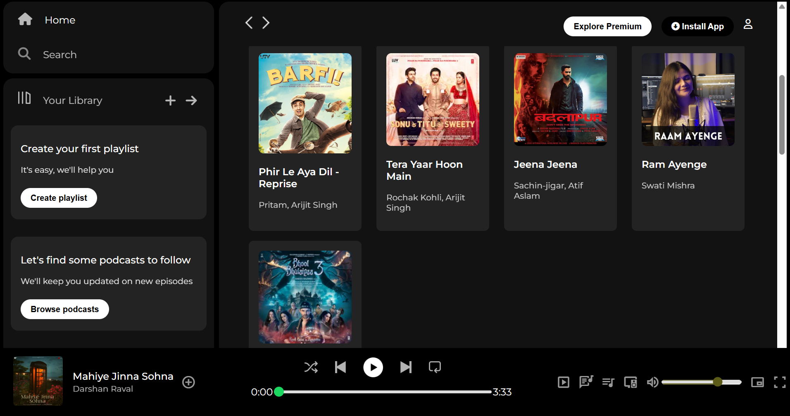

# 🎧 Spotify Clone

A front-end **Spotify UI clone** built using **HTML and CSS**.  
This project replicates the design of Spotify's web interface, including sidebar navigation, playlists, and a now-playing section.

---

## Live Demo

[Click here to view the live project](https://rachit5105.github.io/Spotify-Clone/)

---

## Project Structure

```
Spotify-Clone/
├── index.html
├── style.css
├── assets/
│   └── (images, album covers, icons)
└── README.md
```

---

## Features

- Responsive and clean layout  
- Spotify-inspired design  
- Sidebar navigation and playlist section  
- Footer music player UI (non-functional, design only)

---

## Technologies Used

- **HTML5** – For webpage structure  
- **CSS3** – For layout and styling (using Flexbox, custom fonts, colors)

---

## How to Use

```bash
# Clone the repository
git clone https://github.com/rachit5105/Spotify-Clone.git

# Navigate into the project folder
cd Spotify-Clone

# Open index.html in your browser (double-click or right-click → open with browser)
```

---

## Screenshots



---

## Author

Made with ❤️ by **Rachit Patel**  
- [GitHub Profile](https://github.com/rachit5105)  
- [Live Project](https://rachit5105.github.io/Spotify-Clone/)
